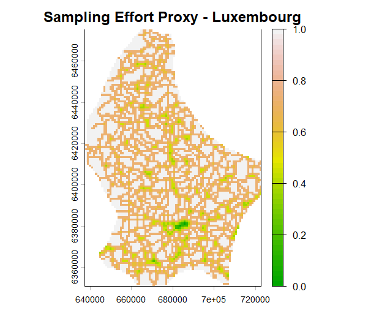
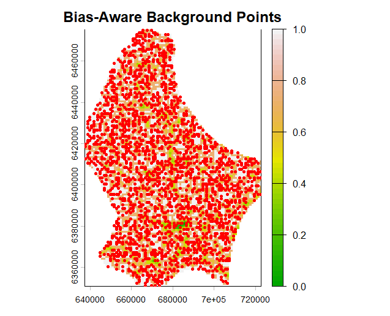
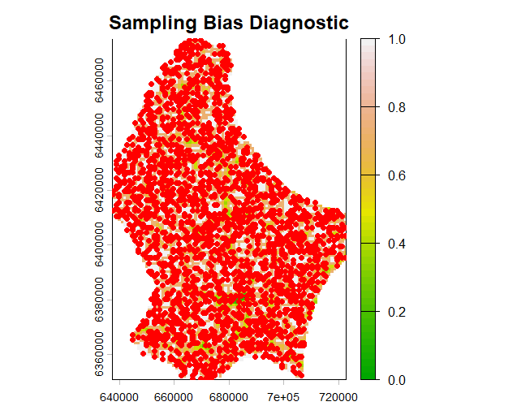

# biasProxyR

**Generating Sampling Effort Proxies for Species Distribution Modeling in Data-Poor Regions.**


## The Problem

When building Species Distribution Models (SDMs) like MaxNet or Random Forest, researchers need "background" points to represent the available environment. In the Global North, researchers often use "target-group backgrounds" to cancel out sampling bias. 

But in the Global South (e.g., Pakistan, Brazil, Kenya), target-group backgrounds often **do not exist** because the baseline biodiversity data is too sparse. If you sample background points randomly across a country, your model doesn't learn where the species grows; it just learns "where the roads and cities are." 

For example, in Pakistan, approximately 75% of GBIF plant records are concentrated in a single province (Punjab), leaving entire regions like Balochistan as "data deserts." Standard SDM workflows fail to account for this severe geographic bias.

## The Solution

`biasProxyR` uses freely available global remote sensing and infrastructure data to map the "probability of human sampling effort." Researchers can then use this proxy map to intelligently sample background points that match the *bias* of their occurrence data, which is the statistically correct way to handle sampling bias when target-group data is absent.

## Core Functions

*   `generate_effort_surface()`: Downloads road density data for a given country and combines it into a single raster representing the probability of human sampling effort.
*   `sample_bias_aware_background()`: Samples background points for SDMs proportionally to the effort surface, effectively canceling out geographic bias in data-poor regions.
*   `diagnose_sampling_bias()`: A publication-ready diagnostic tool that plots occurrence points over the effort surface and calculates a "Bias Correlation Score" to warn users of severe sampling skew.

## Installation

You can install the development version of biasProxyR from GitHub with:

```r
# install.packages("devtools")
devtools::install_github("AamnaNaveed/biasProxyR")

## Visualizing the Output

Here is what the package produces for Luxembourg. Notice how the sampling effort (and our background points) clusters around the major highway networks and cities, accurately reflecting real-world human sampling behavior.

**Sampling Effort Proxy Surface:**


**Bias-Aware Background Points (Red Dots):**


**Sampling Bias Diagnostic:**


## Why This Matters

This package was born out of independent research on biodiversity data gaps in Pakistan. It is designed specifically for researchers, conservationists, and students working in data-poor regions who need to build reliable SDMs despite severe sampling bias. 

By using open remote sensing data (OpenStreetMap, SRTM, NASA VIIRS), `biasProxyR` ensures that conservation planning in the Global South is based on statistically rigorous models, not just artifacts of where researchers happened to drive their cars.

## License

MIT © Aamna Naveed

## Contact

*   **Author:** Aamna Naveed
*   **Email:** naveedaamna4@gmail.com
*   **GitHub:** [AamnaNaveed](https://github.com/AamnaNaveed)
*   **ResearchGate:** [Aamna Naveed](https://www.researchgate.net/profile/Aamna-Naveed)
